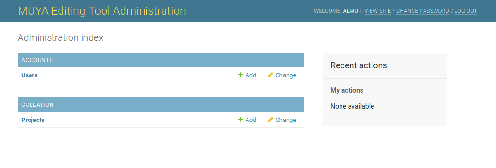
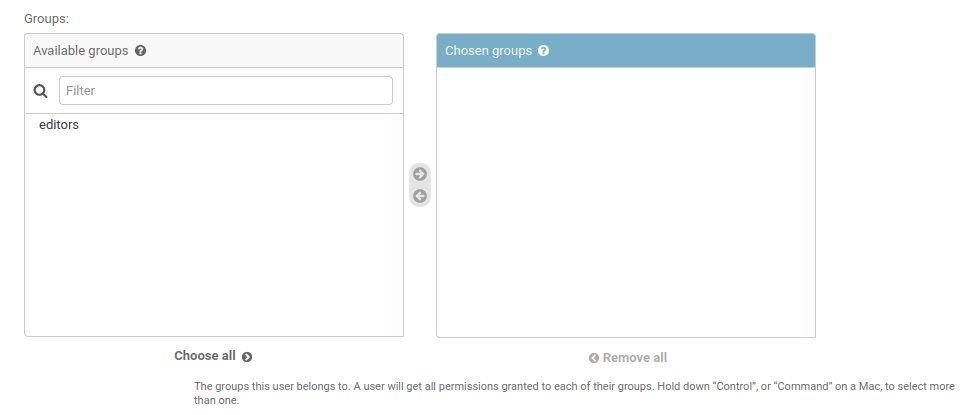
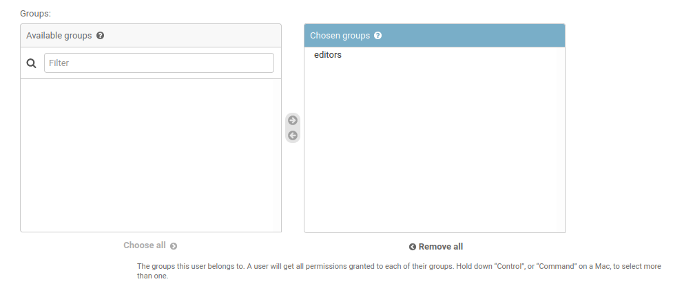
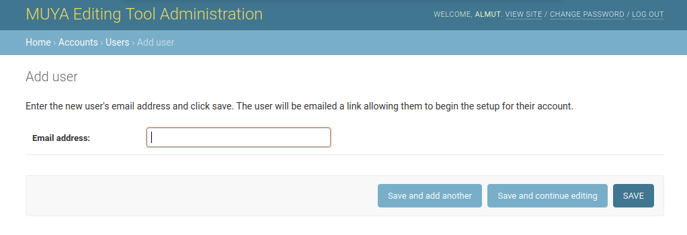

===============================
MUYA Collation Tools User Guide
===============================

This is a guide for the use of the MUYA collation tools. Technical documentation is not included here but can be found
in the code repositories.

.. contents:: Table of Contents
   :depth: 2

User Account Management
=======================

Creating an Account
-------------------

Only authorised users may create an account. If you have been granted access you will receive an email at the email
address you provided to the project team. To create an account, follow the link in the email and complete the required
details. The privacy policy is available to read as part of this process. If you do not agree for your data to be
stored in accordance with the privacy policy, please inform a system administrator and they will be able to delete your
email address from the system.

The link in the email is time limited, so please complete the account registration as soon as possible after receiving
the message.

Account Management
------------------

You can login and logout of the system using the link in the top right corner of the header. Please note that the email
field in the login screen is case sensitive.

You can edit your profile information, including the email address you use to login, by clicking on the email address
shown in the top right corner of the header once you have logged in. You can also change your password using this link.

If you forget your password, you can request a password reset email by following the *Forgotten your password?* link on
the login page. You will need to enter the email address associated with your account for this to work.

New Project Setup
=================

The initial creation of your project must be done by a system administrator following the instructions in the `Project
Administration`_ section. Once you have been granted access to the system and created your account, you should be able
to access any projects created for you.

You must be the managing editor of the project to complete the setup.

This is the workflow to follow when setting up a new project. Links will take you to the detailed instructions for that
task.

1. Select the correct project if required (`Project Selection`_)
2. Upload the transcriptions (`Uploading Transcriptions`_)
3. Select the transcriptions you want to include in your edition (`Selecting Transcriptions for the Project`_)
4. Select the base text you want to collate against (`Selecting the Base Text for the Project`_)
5. Set any supplement ranges required for your project (`Setting Supplement Ranges`_)
6. Set any ceremony mappings required for your project (`Ceremony Mappings`_)
7. Start collating (`Collation`_)

Project Management
==================

The information below assumes you are the managing editor of a project. If you are collaborating on a project for
which another user is acting as the managing editor, not all of the options below will be available to you. You should
ask your managing editor to help with anything you do not have access to.

The project management functions and the progress display are found on the project page which is accessed from the
footer of the main collation page. Several other pages are also linked from this pages to handle specific tasks.

Project Selection
-----------------

If you have editing permissions for more than one project you will need to select the required project from the project
selection page. You will be automatically redirected to this page if no project has been selected. You can switch
projects using the *Switch Project* button on the main collation page. If you only have editing permissions for a
single project you will not see the *Switch Project* button.

Progress Summary
----------------

The project summary shows how many units you have saved at each stage: it does not include units saved by other editors
on the project. This is particularly important when it comes to generating output, as the output functions will only
work on the units for which you have already selected the editorial text. For testing purposes you can also choose to
export units which have been approved by selecting this option in the apparatus output. Units at any earlier stages
cannot be exported.

To see a more detailed summary of each unit, first select a single chapter from the drop-down menu, wait for the data to
reload, and then click on the *Details* button. This will show you when each unit was last saved at each stage by you.
It will not show units saved by other editors on the project. To hide the table of details click on the *Details*
button again.

Selecting Editorial Text
------------------------

Selecting the editorial text is the last stage of the collation process. You can only select the editorial text for
units which you have approved. The interface is access from the *Select Editorial Text* section of the project page.
First select the unit you want to start from using the drop-down menu and then click the *Start* button. This will
open the selected unit in the editorial text selection interface.

The interface will show you the unit being edited and the text of one unit either side if the data is available. Each
of the variant units is presented in a grey box with the editorial text in the editable box at the top and the variants
listed underneath. The text of the ritual directions, in their transcribed and transliterated forms, is also available
for editing.

At the top and bottom of the page you have links to navigate to the next and previous units so you can select the text
of multiple units without returning to the project page. Please note that each unit must be explicitly saved by
pressing the *Save* button before you leave the page or load another unit.

Editorial Text
^^^^^^^^^^^^^^

To select the editorial text for a unit you can type the required text directly in the editorial text box at the top of
the unit. Alternatively you can click on one of the variant readings in the unit and that text will then appear in the
editorial text box. Please note that words must be separated by a space, and punctuation must follow on immediately
after the word (or before for punctuation that precedes a word) with no space between the word and the punctuation.

This interface is also used for controlling the line breaks in your final edition. To add or remove line breaks from
the main text (not ritual directions) click on the button in the unit. The presence of **\\** between the units will
show where a line break will be created. To get a line break at the end of a line in your final edition you will need
to add a line break to the final unit of the line/verse line, otherwise the following unit will continue on the same
line in the LaTeX output.

If the editorial text of a unit is not the same as the language of your project then you must set the correct language
for the unit. To do this, press *Show/Hide Language Options* in the footer of the page to reveal the language select
option for each unit. Use this to check the current language for each unit and change any that are necessary. Any
changes must be saved with the *Save* button. You can only set the language on a unit-by-unit basis, not at the level of
the individual word.

Projects with a language other than Avestan as their primary language also have the option to set the classification of
each unit. The current classification will be indicated in the colour of the editorial text: transcription text will
appear in black and commentary text in blue. To change the classifications click the *Show/Hide Classification Options*
button in the footer to display the drop-down menu in each unit. The classifications can then be changed if necessary
and the unit saved. As with the section of language you can only do this on a unit-by-unit basis not at the level of
the individual word.

Ritual Directions
^^^^^^^^^^^^^^^^^

Both the transcribed and transliterated forms of ritual directions are available for editing in the ritual direction
boxes. They can be edited directly by editing the text in the box.

To add a line break in or directly after a ritual direction, type **\\** at the appropriate point. Please note that if
you need a line break at the end of a line which ends with a ritual direction, you need to add a **\\** at the end of
the final ritual direction. Without this, the next unit will continue on the same line in the LaTeX output.

Setting Supplement Ranges
-------------------------

You will need to set supplement ranges for your project if the following things are true.

* Your project contains supplement transcriptions (those named with the siglum plus S, S1 or S2).
* These supplements only cover some of the units in your project.
* You want the final apparatus output to reference these transcriptions only for the units where they are carrying the
  text.

The supplement range functions are accessed from the *Supplement Range* section of the project page. You will
only see the supplement range section in two circumstances.

1. You have at least one supplement transcription in your list of project transcriptions.
2. You have already stored supplement data in your project.

In the first case you will see a button labelled *Set/Edit Supplement Ranges*. This button will take you to a page
where you can set the supplement ranges. There will be one section of the form for each supplementary transcription in
your project. Each section allows you to set the supplement ranges for the transcription listed at the top of the
section.

In the select box on the right, all of your units are listed. You must select the units where the supplement is the
only one of the two transcriptions that is carrying the text for the unit and use the ‘Add selected’ button to add them
to the box on the right. If a unit is split between the main manuscript and its supplement it should not be included on
in the list on the right. Multiple units can be selected and added at the same time by holding down shift while you click the
first and last witness of the range. Units can be deleted from the box on the right by clicking on the red cross to the
right of the unit label. Units can only be deleted one at a time.

There may be some sections for supplementary transcriptions no longer in the project but for which supplement ranges
have been set. In these cases there will be a warning underneath the two lists and a button to allow you to delete the
data. It is essential that you delete the supplement data for any of the supplementary transcriptions no longer
required for your project. If you do not do this, the output may be missing data. Any deleted section will be
immediately removed from the page but will not be saved until you save the data.

When you are happy with the selection, click *Save* and the page will reload. At the same time it will reorder units in
the grey boxes so they are in order. Units from different books will appear in alphabetical order. The order does not
actually matter: it is just consistent to help you find units more easily.

In the second case you will see a button labelled *Delete Supplement Ranges*. It is important that you review the
supplement ranges if you see this button. It means that you have previously set supplement ranges but no longer have any
supplementary transcriptions in your project. To review the supplement ranges currently set, click on the button. You
will be taken to the supplement range page to review the data. It is essential that you delete the supplement data for
any of the supplementary transcriptions no longer required for your project. If you do not do this, the output may be
missing data. Once you have deleted the data no longer required, press *Save* to save the changes to the database.

Ceremony Mappings
-----------------

Ceremony mappings are stored for each project and are used by the collation editor to draw all of the correct data from
the database for each unit to be collated. They allow you to specify how the Yasna unit identifiers map onto other
ceremonies.

From the *Ceremony Mapping* section of the project page click on the *Set/Edit Ceremony Mapping* button to access the
page for editing the ceremony mappings.

Any mappings already set for your project will be shown in the table. You can filter the mappings based on data from
any of the columns by selecting the column from the drop-down menu above the table and typing the data you want to
filter by in the text box: then press the *Go* button. A * can be added for a wildcard search. For example, to
filter the data to find all of the contexts from chapter 3 you would select *Context* from the drop-down menu and type
**Y.3.\*** in the text box. To remove the filter, click the *Remove filter* button.

Editing the List of Ceremonies
^^^^^^^^^^^^^^^^^^^^^^^^^^^^^^

The initial list of ceremonies identifiers required for mapping will have been set by the administrator when they first
initialised your project. These will be listed in the header row of the table. If no ceremonies were added to your
project in the setup phase the table will only list 'Y' in the header.

You can edit the list of ceremonies by clicking on the *Edit Ceremony List* button in the footer of the page. This will
open the form to edit the list.

You can add new ceremonies to the list by typing the abbreviation identifier into the box labelled *New Ceremony
Identifier* and clicking the *Add* button. This should be repeated for each ceremony you want to add to the list. The
changes need to be saved by clicking on the *Save* button at the bottom right of the form. When you save the changes
the page will reload and the new ceremonies will be added to the table of mappings.

You can also reorder the list of ceremonies if you want them to display in a different order in the table. To move the
position of a ceremony, use your mouse to drag it in to the new position. Again, these changes must be saved with the
*Save* button and when saved will then be reflected in the table layout.

To delete a ceremony or multiple ceremonies from the list, first select the ceremonies you want to remove by clicking on
the relevant checkboxes on the right of each ceremony identifier. When the correct range of ceremonies is selected,
press the *Delete Selected Ceremonies* button. Before any ceremonies are deleted you will be asked to confirm that you
want to delete them. It is important to note that, if you do delete ceremonies, all of the data for that ceremony will
also be removed from the ceremony mapping data. That means that any data in the column for that ceremony in the
ceremony mapping table will be removed if you delete the ceremony. When you confirm the deletion, the ceremonies will be
immediately deleted from the list in the ceremony editing form, but they will only be deleted from the data and from the
ceremony mapping table when you save the changes with the *Save* button. This will delete the data from the database
and these changes will be shown in the reloaded table.

Whether you are adding, deleting or reordering the ceremonies, you can close the form without saving any of the changes
with the *Cancel* button.

Add a Mapping
^^^^^^^^^^^^^

To add a new mapping to the table click on the *Add New* button in the footer. This will open the form for adding and
editing ceremony mappings.

The *Context* box on the form is the Yasna reference which you will type into the collation editor to collate this
unit. It doesn't have to be an actual unit in the Yasna if the section appears in other ceremonies only. However, the
context entry must always start with Y. The format must be Y.[chapter number].[verse/stanza number].[line/verse line
number], for example **Y.1.3.2**.

After adding the context you can add the required data to the boxes relating to the other ceremonies. This data should
follow the same format as the context, but the Y can be replaced with the relevant ceremony identifier. To create
intra-ceremony mappings (to select multiple units from the same ceremony) you can add multiple unit references
separated by semicolons. It is very important to add data to all of the ceremonies that need to be represented for
this context unit, even if the reference is identical to the context. For example if, when you type **Y.1.3.2**, you
want to retrieve this unit from the Y and V ceremonies and **VS.1.3.2** from the VS ceremony, you must add **Y.1.3.2**
in the *Context*, *Y* and *V* boxes and **VS.1.3.2** in the *VS* box.

When all of the mappings have been added, click the *Save* button to add them to the table.

Editing/Deleting the Mappings
^^^^^^^^^^^^^^^^^^^^^^^^^^^^^

Editing a mapping works in the same way as adding a new mapping. However, in order to start the process, first select the
mapping you want to edit with the radio button in the first column of the table, then click the *Edit Selected* button
in the footer. The form is the same as that described in the section for adding a mapping but will be pre-populated
with the existing data for you to edit. The requirements for the data structure are the same as for adding a mapping.

To delete an existing mapping, select the mapping you want to delete with the radio button in the first column of the
table and then click the *Delete Selected* button. You will be asked to confirm you want to continue with the deletion
before the mapping is removed.

Apparatus Output
----------------

The apparatus output section is used to generate the different output formats from the collation data. There are lots
of options which allow you to get the different kind of exports required.

On the first line of the form, there are options to select the stage of the data you want to export, the chapter/s from
your project you want to export and an option to exclude specific units from the export.

Only units saved at the last two phases of collation can be exported: that is, approved units (*approved* in the select
menu) and units for which the editorial text has been selected (*text selected* in the select menu). It is essential
that you check the unit counts for the stage you want to export and ensure they are what you expect, as only saved units
will be exported and there will be no warning if units are omitted because data is missing for a unit at the requested
stage. Line breaks, languages, translation commentary markers and your selected editorial text will only appear if you
select the *text selected* option. The *approved* option is provided to allow testing of the apparatus at the earliest
possible point while an edition is being created.

The chapter selection has the option to output all chapters in your project or a single chapter. In addition, you can
exclude specific units in the chapter/s selected. To add a unit to the excluded list select the unit from the menu and
click the *Add* button. The unit will appear on the list of excluded units. Repeat this for each unit you want to
exclude. To remove a unit from the list, click the red cross to the right of the unit identifier.

On the second row of the form there are options to include or exclude the apparatus for all units or only for a
selection of units. To include the apparatus, select *Yes*; to exclude all of the apparatus select *No*. If you do want
to include the apparatus, it can still be excluded from certain units by adding them to the list of excluded units in
the same way as described for the unit export exclusion.

On the third row of the form, there is an option to select what form, if any, you would like to use for the ritual
directions in the export.

The next row of the form has an option to automatically add a raised plus symbol before any reading which has no direct
witness support (excluding the editorial text).

On the final row of the form, you select the export format required. There are three options: the LaTeX option is to be
used for the print edition; the XML is to be used for the online editions; the CBGM for importing into the CBGM
tools.

When all of the required options have been selected, click the *Get Apparatus* button to start the export. When you
start the process a message box will appear in the top left of the screen: this will display a task id. While the task
is queuing and while the process is running, dots will appear in the message window. If the apparatus is successfully
generated, then the message window will let you know that the resulting file is ready to download. Click on the link
in the message to download the file.

If the apparatus generation fails, then you should get a message to tell you that. You may need to seek help from the
technical team to interpret the message and to work out how it can be fixed. The error message will usually give
details of the file and line number in the error message which should help the technical team to locate the problem.
When consulting the technical team you should always provide the task id as this may help them to locate the problem.

It is also possible that something will go wrong without the browser knowing about it. In this case dots will be
continuously printed and will wrap onto mulitiple lines of the message box. If the dots fill multiple lines of the
message box it is most likely that the task has failed or failed to start and you should try again.

If you do get errors messages or a several lines of dots then it is always worth trying the same export again or, if
you are trying to export all the chapters, try the same export on individual chapters to find out where the problem
might be in your data. If you get the same result or a different error then it should be reported to the technical
team. When reporting problems you should include details of the settings you were using to export the apparatus, the
content of the error message (if present) and the task id reported in the message. They should be able to help you to
fix the problem. Some guidance is provided in the `Additional Features Available to Superusers`_ section.

If you get repeated failures and the message box is saying 'Your task is waiting to start', then it is likely that
either the Celery service or RabbitMQ service on the server have stopped working. The technical team should be asked
to check for this and restart any stopped services.

If you want to understand more about the apparatus generation process, what is going on behind the scenes and what the
different responses mean, you can read the description in the `Processes for Long-Running Tasks`_ section which tries
to explain the process without too many of the technical details.

Transcription Management
========================

The transcription management page is accessed from the project page, which itself can be accessed from the main
collation page.

On the transcription management page you can:

* access the transcription upload page which allows validation, uploading and deleting of transcriptions
* set the transcriptions to be used in your collation project
* select the base text for your collation project
* download selected project transcriptions
* extract notes or ritual directions from project transcriptions

Only the first item and the last two items on the list are available for project editors who are not the managing
editor.

Validating Transcriptions
-------------------------

From the transcription management page, click on the *Add/Delete Transcriptions* button to access the transcription
upload page.

To validate a transcription use the *Browse...* button to select the transcription on your computer and click the
*Validate* button to validate.

Before validating against the project XML schema, the validation process checks a few things that must be correct for
the indexing to start. These are:

* that the siglum follows the correct format
* that all corrector hands have been identified in the header
* that there are no app tags embedded within app tags

The transcription is then validated against the XML schema for the project. It is possible to skip the XML schema
validation step if you choose by checking the *Skip schema validation* box. This is not recommended and doing so increases
the risk that the data will not be extracted correctly in the upload process.

The results are communicated in a pop up window in the top left of the page. If the transcription passes the tests then
you will get a message to say it is valid. If it fails, the reasons for the failure will be reported. If the
transcription fails the schema validation, the errors will be reported but they are not easy to interpret and relate
back to the transcription. It is much easier to fix validation problems in a dedicated XML editor that supports schema
validation. There are several such editors available as open source or commercial products. If you don't know where to
start, Jedit (http://www.jedit.org/) with the _XML plugin (http://plugins.jedit.org/plugins/?XML) is a good free option
and Oxygen (https://www.oxygenxml.com/) an excellent commercial option.

The schema used for validation can be downloaded from this page for use in XML editors.

.. note::

    Strictly speaking the schema that you download is not the exact schema that is used for the validation tasks on the
    transcription management page. The website uses the XML schema (\.xsd) format (because it is easier to work with in
    Python) and the download file is the RELAXNG (\.rng) format (which is easier to work with in XML editors). Both of
    these files were generated using The TEI Roma tool using the same ODD file so they contain the same data, just in
    different formats.

Uploading Transcriptions
------------------------

From the transcription management page click on the *Add/Delete Transcriptions* button to access the transcription
upload page.

Before a transcription can be uploaded, it must meet the requirements for validation described in the `Validating
Transcriptions`_ section. If you try to upload a transcription which does not meet the criteria, then it will be
rejected. The error messages from the uploading section are not as detailed as those in the validating section, so
before trying to upload a transcription it is best to check its validation status and fix any errors.

To upload a transcription first use the *Browse...* button to select the file on your computer. Then select the
languages you want to be extracted from the transcription as part of the upload process. These languages refer only to
the languages that will be extracted from verses and verse lines (in other words the text you are going to be
collating). Ritual directions, regardless of their language, will always be extracted. As with validation, you have the
option to skip the schema validation but this is discouraged as, if the transcription does not comply with the expected
format, the text extraction is more likely to be incorrect. When you have selected the transcription and languages
click the *Upload* button to start the upload process.

When you start the upload process, a message box will appear in the top left of the screen: it will display a task id.
While the task is queuing and while the process is running, dots will appear in the message window. If the indexing
completes  successfully then the message window will let you know that the indexing is complete. If the task fails then
you should get a message to tell you that. You may need to seek help from the technical team to interpret the message
and to work out what needs to happen to the transcription to fix it. It is also possible that something will go wrong
without the browser knowing about it. n this case dots will be continuously printed and will wrap onto mulitiple lines
of the message box. If the dots fill multiple lines of the message box it is most likely that the task has failed or
failed to start and you should try again.

If you do get errors messages or a several lines of dots then it is always worth trying the same export again or, if
you are trying to export all the chapters, try the same export on individual chapters to find out where the problem
might be in your data. If you get the same result or a different error then it should be reported to the technical
team. When reporting problems you should include details of the settings you were using to export the apparatus, the
content of the error message (if present) and the task id reported in the message. They should be able to help you to
fix the problem. Some guidance is provided in the `Additional Features Available to Superusers`_ section.

If you get repeated failures and the message box is saying 'Your task is waiting to start', then it is likely that
either the Celery service or RabbitMQ service on the server have stopped working. The technical team should be asked
to check for this and restart any stopped services.

If you want to understand more about the apparatus generation process, what is going on behind the scenes and what the
different responses mean, you can read the description in the `Processes for Long-Running Tasks`_ section which tries
to explain the process without too many of the technical details.

If the indexing completes successfully, you also have the option of checking what has been extracted from the
transcription. This was originally added for testing the extraction of different languages but might be useful in other
situations. If you want to check the data you must click on the *See Ingested Data* button on the main page **before**
you close the message window.

The data will be displayed in a table showing the language, the context, the hand and the extracted text. The units
will be displayed in transcription order.

Deleting Transcriptions
-----------------------

From the transcription management page click on the *Add/Delete Transcriptions* button to access the transcription
upload page.

You can delete any of the transcriptions that you uploaded (and therefore own) by selecting the transcription
identifier from the drop-down menu and clicking the *Delete* button. You will be asked to confirm the deletion before
the transcription is removed from the database. Please note that the drop-down menu is not filtered by project and will
include all transcriptions in the system which you own.

The identifier has several parts which give you information about the content of the transcription. For example in the
identifier **AV_500_Y3-Y8_1**:

* **AV** refers to the corpus (always AV for MUYA).
* **500** is the transcription siglum, including any supplement details such as 500S or 500S1.
* **Y3-Y8** indicates the chapter range covered in the transcription. This is automatically generated when the
  transcription is uploaded and refers to the lowest Y chapter and the highest Y chapter in the transcription.
* **1** is the user identifier for the owner of the transcription and can be ignored for deletion purposes as it will
  always be you.

If you are uploading a transcription with the same siglum and the same chapter range, there is no need to delete the
existing transcription first: it will automatically be overwritten by the new one. If you have added new chapters to
the transcription, which change the range covered, then the new transcription will be treated as a completely new
transcription with a different identifier.

When deleting transcriptions you no longer need, please pay attention to the identifier to make sure you are deleting
the correct transcription. The transcriptions in the deletion list are presented in order of siglum to make this
easier.

When you delete a transcription it will automatically be removed from your project's transcription list (see `Selecting
Transcriptions for the Project`_).

Selecting Transcriptions for the Project
----------------------------------------

In the *Project Transcription Selection* of the transcription management page, you can select the transcriptions which
will be included in your project. There are two lists of transcription identifiers (the data contained in the
transcription identifier is explained in the `Deleting Transcriptions`_ section). The one on the left, headed
*Transcriptions in project*, lists all of the transcriptions currently in your project. If you are setting up a
new project this list will be empty. The list on the right, headed *Additional transcriptions available*, lists all of
the transcriptions that you own (i.e. have uploaded) but are not included in this project. It is important to note that
these transcriptions may be included in other projects, if you work across multiple projects. If you have not yet
uploaded any transcriptions, then this list will be empty.

To include a transcription in your project, drag the transcription identifier from the list on the right into the list
on the left. To remove a transcription from your project drag the transcription identifier from the list on the right
into the list on the left. To save, click the *Save Transcription Selection* button above the lists. When you save, the
page will reload and both lists of transcriptions will be reordered by siglum.

Selecting the Base Text for the Project
---------------------------------------

Above the two lists of transcriptions is a drop-down menu to select the transcription to use as the base text. This is
the transcription that will be used along the top of your collation to order the variants, although the collation itself
is baseless.

For the purposes of collation, the base text can be any transcription which is valid for uploading into the system.
However, to ensure the MUYA project apparatus output scripts work, your base text should also:

* have the siglum *basetext*.
* not contain corrections.
* contain text in all units you want to collate, in the order you want them to appear in the final edition.
* contain all (and only) the ritual directions you want to include in the final edition.
* only contain lines/verse lines in a single language (transcriptions may include the subtypes translation and
  commentary in the same file, but the base text must be single language).

The drop-down menu contains all of the transcriptions saved in the project transcriptions list. It is only updated when
you save the transcription lists, so if this is the first time you are adding transcriptions to the project you will
need to save the transcription selection before you can select a base text. If the currently-selected base text is
removed from the list of project transcriptions, then the base text selection will be removed and a new base text must
be selected.

When you have selected a base text you must save the selection using the *Save Transcription Selection* button.

Exporting Data from Transcriptions
----------------------------------

The *Transcription Export Options* allow you to extract and download data from the transcriptions included in this
project. Only transcriptions currently included in this project will appear in these menus.

The first option allows you to download a copy of the transcription that is indexed in the collation editor. Please do
not rely on this as a backup. The file that is downloaded should be saved with the .xml file extension.

The second and third options allow you to extract the contents of the note tags or the ritual directions, either from
all of your project transcriptions or from a single transcription on the list. Both of these operations are
long-running tasks which follow the same workflow as uploading transcriptions and creating the apparatus. An overview
of the process along with some of the things that might go wrong are explained in the
`Processes for Long-Running Tasks`_ section. If everything works as expected, a *Download* link will appear in the
message box. When you click on this link a csv file will be downloaded. This file uses tabs as the separators between
the different elements of the data and it can easily be used in spreadsheet software.

The easiest way to access the csv data in a spreadsheet format is as follows:

* Open the csv file in a plain text editor. This could be jEdit, Notepad on Windows or something like BBedit on Mac.
  It is important that you use a text editor and not a word processing program (such as Microsoft Word).
* Select the content and copy it.
* Open a new empty spreadsheet in Excel or another spreadsheet program (this has only been tested with Excel).
* Paste the content into the spreadsheet.
* You can then save the file as an Excel file and use it just like any other spreadsheet.

Collation
=========

At a technical level the collation tool used by MUYA has several layers.

* At the core is CollateX (https://collatex.net/) which handles the alignment. CollateX does not provide any GUI
  components: for this particular implementation the data is passed to CollateX in JSON and the alignment table it
  returns is also in JSON.

* The Collation Editor (https://github.com/itsee-birmingham/collation_editor_core) provides the GUI drag-and-drop
  interface for handling the interaction with CollateX and the further editing of the data. This code is highly
  configurable and is used in several platforms and with many different manuscript traditions and languages. This
  documentation will only cover the specific configurations that are used in the MUYA project. Further documentation
  can be found in the code repository.

* Around the collation editor is the broader Django system built for MUYA which provides all the other functions
  covered in this documentation. Much of the collation editor configuration used for MUYA is set in this Django
  wrapper. If any of this needs to change for specific projects, then the technical team will need to help with this.

As an editor, the collation part of the system allows you to regularise noise, fix any misalignments and set the length
of the variant units. It is also possible to set the order of the readings in each unit. However, for MUYA it was decided
that the order of the readings could always be algorithmically determined and, as such, the apparatus output process
always reorders the readings, so the order readings phase of collation should be ignored.

The Editor works on each collation unit separately. For MUYA, these are the lines or verselines in your transcriptions.

Within each collation unit, the four stages of the Editor are:

* Regularise (Reg, RG)
* Set Variants (Set, SV)
* Order Variants (Ord, OR)
* Approve (App)

The abbreviations in brackets will sometimes be used as shorthand for the stages in our documentation or on the screen.

Once units have been approved, move to the `Project Management`_ section to select the editorial text and output the
apparatus.

The collation editor is a one-way system. Changes you make at later stages are not reflected in earlier data. Only the
regularisation stage retrieves the transcription data directly from the database: the later stages manipulate the
collation data directly. This means that if you make changes to a transcription, you need to recollate any unit with
changes and then take the new data through all of the different stages in order for it to appear in the apparatus. The
regularisation rules that you make in the regularisation stage are reapplied when you recollate. However, some rule
types do use a word's position in the transcription as well as the actual characters in the word to determine whether it
should be applied. This means that if you have made a change to a transcription which changes the word position then
some existing rules may not be applied and will need to be remade.

Running a Collation
-------------------

The collation editor has only been tested in Firefox and Chrome. It does not work in Safari and may not work in other
browsers, so please stick to Firefox or Chrome.

To run a collation, go to the main collation page and type in the reference for the unit you want to collate. Click the
*Collate Project Witnesses* button. The collation editor then retrieves all of the relevant data from the database and
sends it to CollateX for alignment. If you have set ceremony mappings for your project, then the units mapped to the
collation unit you entered should also be included in the collation. The collation can take some time, depending on the
amount of data you are processing. When the alignment is complete, the data will be shown on the screen. Sometimes a
better alignment can be achieved by trying different alignment algorithms or changing the fuzzy matching distance. The
fuzzy matching distance determines how many characters in a string can differ when the string may still be considered a
match. If you want to change the settings used by collate, this can be done using the *Change Collation Settings* button
in the footer.

Loading a Saved Collation
-------------------------

To load a saved collation, go to the main collation page and type in the reference for the unit you want to collate.
Click the *Load Saved Collation* button. You will then be shown a table that will list all of the saved collations by
user and by collation stage. Select the collation you want to load and click the *Load collation* button in the footer.
The saved collation will be loaded.

The General Layout
------------------

CollateX does not use a base text for collation. However, in order to present the data in a way that it can be easily
understood and edited, we use a base text for the display. The base text appears at the very top of the screen, above the
numbers and the dividing line. The numbers represent words (even) and spaces (odd). The base text will be repeated in
the ‘a’ reading of every unit but the sigla will be ignored in the output. To see what manuscripts read each reading,
hover over the reading and a list of sigla will appear.

At all stages the following features are available in the footer:

* To highlight a witness in the collation, use the drop-down box towards the right of the footer. This will highlight
  the selected witness in the collation table and display its text just above the footer.
* The save button is also located towards the right of the footer. Each person can only have one collation saved at
  each stage for each collation unit. It is strongly recommended that you save each stage when you are happy with it
  before moving onto the next stage.
* Towards the left of the footer there are four links: Reg, Set, Ord, App. Any of these links that are active
  (underlined and coloured green) indicate that the managing editor of the project has a saved version of the current
  collation unit at that stage. The active links do take a few moments to load on each screen as it has to retrieve the
  data from the database, so you need to be a little bit patient to see the true situation. Clicking on one of these
  links takes you to the version saved by the managing editor at this stage. Please note that, even if you are the
  managing editor of the project, this may be different from moving to the next stage with your live data.

Regularisation
--------------

At this stage you can:

* change the display settings
* make token-to-token regularisation rules
* delete token-to-token regularisation rules

The following additional footer buttons are available:

* *show regularisations* shows you the rules that have been applied to this collation unit
* *move to set variants* moves the current data to the set variants stage
* *settings* opens a form to allow you to change the display settings
* *recollate* sends the data to CollateX to rerun the alignment. Please note that rules are not saved until you recollate.

Changing the Display Settings
^^^^^^^^^^^^^^^^^^^^^^^^^^^^^

Click on the *settings* button and this will open the menu to change the settings. Select or unselect the options as
required and then click *save and recollate* to apply your changes.

Making a Regularisation Rule
^^^^^^^^^^^^^^^^^^^^^^^^^^^^

Drag the word you want to regularise onto the word you want it to be regularised to. This can only happen within a
variant unit (grey box). If the word you want to regularise to is not present, it can be added by clicking on the + at
the bottom of each unit and typing in the word. You can then drop the word being regularised onto this new word as
normal. When a word is dropped on another, a menu is opened. The menu tells you what word is being regularised and to
what. It also asks you to select the type of rule you want to create and the classification you want to use for it.
There are also a few options such as *ignore supplied markers* which can be selected if desired. When all the correct
options have been selected, press *save* to create the rule. The rule will be saved in memory but will not be saved to
the database until you recollate. The word that has been regularised will appear in grey and the siglum of the
regularised word will appear in the hover-over list for the word it has been regularised to. Many rules can be created
before you recollate.

Deleting a Rule Before Recollation
^^^^^^^^^^^^^^^^^^^^^^^^^^^^^^^^^^

Right click on the word in grey and select *delete rule* from the menu.

Deleting a Rule After Recollation
^^^^^^^^^^^^^^^^^^^^^^^^^^^^^^^^^

Click the *show regularisations button* in the footer to see all the rules you have already created. Right click on a
rule and select *delete rule* from the menu. If you are trying to delete a global rule you will be given the option of
deleting the entire rule, in which case it will no longer apply in any new collations of any unit, or you can add an
exception to prevent the rule from applying to this particular unit only. Multiple rules can be selected by dragging
the mouse over a list of rules (the selected rules will turn pink) and then right click on any of these to bring up the delete
rule menu. Non-adjacent rules from the same collation unit can be selected by holding down control and left clicking on
them. Again, use the right click on any of the selected rules to bring up the delete rule menu. If the unit is taking
longer than usual to collate when you have been deleting rules then just reload the main menu page, load the unit again
and continue to delete any remaining unwanted rules.

Set Variants
------------

This is the stage at which much of the editorial work takes place. You can:

* correct the automatic alignment by moving readings around
* set the length of variant units
* regularise multi-word readings
* make overlapping variants if required (not currently used by MUYA)

Correcting the Alignment
^^^^^^^^^^^^^^^^^^^^^^^^

To move a reading to another unit or into a space where there is not a current reading, start by right clicking on the
unit and selecting *Split readings*. This will show you an exploded view of the unit and each reading now operates
independently.

To move a reading into an existing unit, pick up the reading and drop it on the new unit. The unit does not need to
be adjacent.

To move a reading into a space that does not currently contain a unit, drop it on the number for the space. This can be
tricky and you need to be precise. It is the mouse which must be on the number. When the number is correctly selected
it will be highlighted, but unfortunately it is often hidden by the reading you are moving. You will get the hang of
this with practice.

If you drag the words of a witness out of order, then the system will notice and you will get a warning telling you
which witnesses have words that are out of order. It allows the words to be out of order because sometimes it is
necessary when you are fixing incorrect alignment. The words of each witness must be in the correct order before you
move on to the next stage.

When you have finished rearranging the readings in the unit, it must be recombined by right clicking and selecting
*Recombine*

If the alignment has gone wrong in such a way that you need to move a word only for a subset of its witnesses you can
split the reading into two. First, right click on the unit and select *Split readings* so you are working with
individual readings. Then right click on the reading you want to split and select *Split witnesses* from the menu.
Select the witnesses you want to separate and click *Split witnesses*.  You will see two versions of the reading in the
exploded unit: each will now function as separate readings and can be moved or left where they are, as needed (hover
your mouse over the reading to check which witnesses are linked to each reading). When you recombine the unit any
remaining duplicated readings will be recombined.

Setting Variant Lengths
^^^^^^^^^^^^^^^^^^^^^^^

To combine units, drag one onto another. Only adjacent units can be combined. Occasionally when two units are combined
an additional unit will appear; this is a specially created unit used to show a gap that has nowhere else to go. You
can combine it with another unit to make it go away.

To split a unit, right click on the unit and select *Split words*.

Regularising a Reading
^^^^^^^^^^^^^^^^^^^^^^

To regularise a reading, first split the unit into readings by right clicking on the unit and select *Split readings*.
You can then right click on the reading you want to regularise and you will see the regularisation categories in the
menu. To regularise the reading click on the category you want to use. This will show a menu which allows you to select
the parent reading (the one you want to regularise the reading to), it will also allow you to select only a subset of
witnesses if you need to. You can add a new parent reading if necessary by selecting *other* from the list and typing
the new reading text into the box. There are some special parent readings on the list such as *lac* and *om* which
should be used if you want to regularise to these categories.

To prevent the over-application of regularised readings, the regularisations will only be applied if there are no
changes to the text of the readings involved in the regularisation after it is made. It is therefore advised that all
other editing operations are completed first, such as fixing the alignment and setting variant lengths, before moving
onto regularising readings at this stage. If there are any changes to either the regularised or parent reading then the original
readings will be displayed and the regularisation will be deleted.

Order readings
--------------

This stage should largely be ignored by MUYA, but you may still find is useful to:

* regularise a reading by right clicking on the reading and working through the process as for Set Variants

In other systems, where reading order is not algorithmically determined in the output scripts, this stage also allows you
to:

* reorder readings by dragging the plus sign to the right of the reading
* edit the label or each reading by right clicking on the label itself

Approved
--------

Once a collation has been approved, you can view the approved version in this screen but no further editing can take
place. This screen also allows you to get the export output for the unit as a test.

Once units have been approved, the editorial text can be selected (`Selecting Editorial Text`_).

Processes for Long-Running Tasks
================================

Long-running tasks cannot use the standard protocol used on the internet (HTTP) because, if a browser does not get
a quick response to an HTTP request, it gives up and reports a time out error. This means that for long-running tasks,
such as extracting the collation data from a transcription or generating the apparatus from the collation data, we
need a different approach. I will try and explain the approach here in a very general way because it might help
understand some of the responses you might get, I will use uploading a transcription as the example.

When you upload a transcription, the file you selected is sent to the server. The server puts the data and the request
to index it into a queue and uses HTTP to return a message to the browser to say that the task is in the queue. At this
point the grey box will appear in the top left of the page. The message displayed in the message box let you know which
stage of the workflow you task has reached. There are several stages and associated messages which are explained in
the following sessions.

Stage 1 - The Request
---------------------

In the first stage the request for a task to be performed has been sent to the server. The message box will display the
task if only. This stage should be very quick and you may not even notice it.

Stage 2 - The Queue
-------------------

In the second stage your task is added to a queue of tasks to be processed by the server. The message displayed at this
stage, along with the task id, is 'Your task is waiting to start'. During this stage your browser will keep checking
the server to see if the task has moved to the next stage. Each time the server is checked a dot is printed in the
message box. Your task should not spend a lot of time in the queue. If the dots wrap onto a second line and the message
has not changed, then it is very likely that one of the services on the server has stopped running. In this case, you
should follow the instructions in the `Troubleshooting`_ section.

Stage 3 - Task Processing
-------------------------

Once your task gets to the front of the queue it will start running. The message displayed at this stage, along with
the task id, will indicate that your task is in progress: the exact wording of the message will depend on the task.
Again in this stage, the browser will keep checking the server to see if the task is still being processed or if it has
been completed. While the task is still running, each time the server is checked another dot will be added to the
message box.

Stage 4 - The Result
--------------------

The task can have several outcomes.

* It could be completed successfully. In this case the message box will tell you that the task has been completed and,
  in the case of data generation, a download link will appear so that you can download the results.
* It could fail somewhere predictable. In this case the message box will display an error message.
* It could fail somewhere unexpected. In this case the system will probably just keep printing dots to the message box.

If you get several lines of dots after the task had started, then it is very likely that something unexpected has gone
wrong. In this case, you should follow the instructions in the `Troubleshooting`_ section.

Troubleshooting
---------------

The first thing to do if you get either several lines of dots or an error message is simply to try again. If you get
the same problem or a different one then it will need to be investigated by the technical team. You can do a lot to
help them by reporting the error with the following details:

* what you were trying to do when the problem occurred
* the message in the message box
* the task id reported in the message box
* the XML of the transcription you were trying to upload, if applicable

If the task gets stuck in stage 2 then it is likely that there is something wrong with either RabbitMQ or Celery.
The technical team should check that RabbitMQ and Celery are still running and fix any problems with the services or
the queues.

If the task gets stuck in stage 3 then it is likely that an error occurred at a point of the code that does not return
a proper error message (perhaps somewhere it has never failed before). If this happens, then there is probably
something wrong in the data being processed. A superuser from the technical team can look up the task id in the admin
interface (see `Additional Features Available to Superusers`_) to locate the error and help to identify the problem
and the solution.

Admin Interface
===============

.. warning::
    You can do a lot of damage in the admin interface if you are not careful.

    If you are not sure how to do something, check with technical staff before making any changes.

    If in doubt, **do not touch**.

Access to Admin interface
-------------------------
Any registered user *can* be given access to the admin interface. However, only users who really *need* access should
be granted these privileges. As a general rule, at least one of the technical support team should have superuser status
and at least one of the research team should have staff status.

The admin interface can be accessed at the admin url. For reasons of security it is not published in the documentation.
Users with the correct permissions can log in using the same credentials used for the other tools.

Overview
--------

The admin interface allows trusted users who have staff or superuser permissions to make changes directly to the
database. Not all data is available in the interface: it has been kept to a minimum for security and safety.
This section will cover the data available in the interface and the tasks admin users might need to perform.

This documentation mainly covers the tasks that are the responsibility of the research team but touches on some other
data which may be useful to the technical team.

Figure 1 shows the administration index page for staff users. The one for superusers is similar but has a few
additional sections. In the section titled *ACCOUNTS* you can add, edit and delete users. In the section titled
*COLLATION* you can add and edit collation projects. If the index page does not list both the *ACCOUNTS* section and
the *COLLATION* section you should contact a member of the technical team who may need to alter your permissions to
allow access to the User and Project objects.

When you are navigating around the admin interface a breadcrumb trail will appear directly below the header section
that reads *MUYA Editing Tool Administration*. Clicking on *Home* in the breadcrumb trail will always bring you back to
the index page.

   Figure 1: The administration index page for staff users.

Add User and Project Workflow
^^^^^^^^^^^^^^^^^^^^^^^^^^^^^

The most common use of the admin interface is going to be creating new users and projects. This is a summary of the
workflow for doing this. Detailed instructions for each step are provided in the rest of this section.

#. Make a new user
#. Assign the user to the editors group
#. Make a new project with the new user as the managing editor

If you do all of these steps, then the new user will be able to login and immediately start following instructions in
the `New Project Setup`_ section to upload their transcriptions, finish the setup of their project
and start collating.

User Administration
-------------------

Some of the user data held in the system are considered personal data by the General Data Protection Regulations.
Access to these data and restrictions governing their usage should be laid out in the privacy policy for these tools.
Please keep the privacy policy in mind at all times when working with the user data.

Viewing user data
^^^^^^^^^^^^^^^^^

Clicking on the `users` link in the *ACCOUNTS* section will show you a list of all of the currently registered users.

To see a more detailed view of a single user you can click on their user name.

Editing a user
^^^^^^^^^^^^^^
You can edit user details in the detailed view of the user. Most of this data should be managed by the user themselves
(see User Account Management) and should not be changed in the administration interface. The only things that should be
changed in this interface are in the *Permissions* section.

In the first part the Permissions section you can grant staff or superuser status to a user by checking the appropriate
box. However, this should be done with caution, as explained in `Access to Admin interface`_. It is important that the
first box in this first section titled *Active* is checked unless you are deliberately deactivating the user (see
`Deleting and deactivating a user`_).

.. _`group assignment`:

The next part of the section, labelled *Groups*, allows you to select the group(s) to which this user belongs. All
users who need access to the editing tools should be in the group called *editors*. Figure 2 shows this section of the
form before the user has been made a member of the editors group.

   Figure 2: The group permissions section of the form before a user has been added to the editors group.

If this group is in the box on the right hand side headed *Chosen groups* then the user is a member of that group. If
the *editors* group is in the box on the left headed *Available groups*, then this user has not been assigned
membership of the group. To assign the user to the group select the *editors* group in the left box by clicking on it.
The right pointing arrow in between the boxes should then be activated. Click on this arrow to move the *editors* group
from the available groups box into the chosen groups box. Figure 3 shows this section of the form when the user has
been added to the editors group.

   Figure 3: The group permissions section of the form after a user has been added to the editors group.

The final part of the Permissions section, labelled *User permissions*, should not be needed unless the tools are
extended. This section allows more fine-grained permissions to be assigned to users, but all of the required
permissions for these tools are handled with the group permissions described above. There may be an exception for staff
users who should be given access to the user and project objects if these are not available when the staff user first
logs into the admin interface.

When you have made all the changes you want to make, it is important to save them using the save button at the bottom of
the screen.

Adding a user
^^^^^^^^^^^^^
Users are added using only an email address.

The user adding interface can be accessed in two ways:

- from the index page by clicking on the *Add* link to the right of the line that reads *Users* in the *ACCOUNTS* section.

- from the list of current users by clicking on the *ADD USER* button at the top right of the page.

Either of these links will take you to the form illustrated in Figure 4.

   Figure 4: The add user form.

Enter the email address of the new user into the box and click the *Save* button. This will take you to the details
page for the user. Assuming this user requires access to the editing tools, you should now follow the instructions for
`group assignment`_ to assign the new user to the editors group. Once you have done this, save the user again.

As soon as the email address of the new user is saved, the user will be sent an email inviting them to create an account
on the system. The email includes a special registration link which is time-limited (it lasts around two days). If the
user does not create their account in this time frame, the link will no longer work. The easiest way to resend the email
without technical support is to `delete the user`_ and add them again. Alternatively the user can ask for their
password to be reset following the instructions in the `User Account Management`_ section. When their password is reset,
they will be able to complete the account registration.

It is recommended that the user is added to the editors group immediately after the email address is added, so that when
the user first logs into the system they will have all of the permissions they need.

.. _`delete the user`:

Deleting and deactivating a user
^^^^^^^^^^^^^^^^^^^^^^^^^^^^^^^^
It will not always be possible to delete a user using the admin interface. If a user has already uploaded
transcriptions or has made collations, then you will need help from the technical team in order to delete the user.
However, you can always disable access to the system for any user without deleting their account by deactivating it.

Deactivating a user
~~~~~~~~~~~~~~~~~~~
To deactivate a user go to the page containing the full details for the user. In the *Permissions* section uncheck the
box titled *Active*. Save the change by clicking on the *Save* button at the bottom of the page. This will mean that
the user can no longer log into the system, but any data they have saved in the system will still be preserved.

If the account has been deleted at the request of a user, then data-protection regulations probably do require it to be
deleted completely. In this case, you will need to ask the technical team to help (see `Deleting a user`_ for more
details).

Deleting a user
~~~~~~~~~~~~~~~
If a user has been added in error and has not yet been made the managing editor of a project, then the user can be
deleted by either:

* selecting the user on the list of users, choosing *Delete selected users* from the *Action* drop-down box and
  clicking *Go*.
* going to the full details page for the user and clicking the *Delete* button at the bottom of the page.

You will be asked to confirm that you want to delete the user, regardless of which path you take.

If the user has already been added as the managing editor of a project, but has not yet uploaded any transcriptions or
made any collations, then you will need to delete the project first before the user can be deleted. The project can be
deleted in the same was as a user, but from the list of projects or the full details page for the project.

If the user has already uploaded some transcriptions or has made some collations, then you cannot delete the user until
either all of the objects in the database that they own are also deleted or are transferred to another user. If you try
to delete a user who owns other data in the database, then all of the items will be listed in an error page. The
technical team should be able to delete these objects for you using the Django shell command in a terminal on the
server. It is also possible to delete or reassign entries directly in the Postgres database, but it is probably safer to
use the Django shell.

The research team should consider what should be done with any existing data.

The technical team  should check the following models for references to the user in the following order:

* From the transcriptions app

  * Transcription (CollationUnit objects should be deleted automatically by the cascade method)

* From the collation app

  * Collation

* From the collations app

  * Project

* Finally you can delete the user.

Project Administration
----------------------

Create a new project
^^^^^^^^^^^^^^^^^^^^

The process to create a new project can be started in two ways

- from the index page, by clicking on the *Add* link to the right of the line that reads *Projects* in the *COLLATION* section.

- from the list of current projects, by clicking on the *ADD PROJECT* button at the top right of the page.

All elements on the form, from the top down to and including *Ceremonies*, require some attention in this form. They are
listed and described below.

The remaining three sections should not be touched. They are managed by the project's managing editor in the project
management interfaces (see `Project Management`_ and `Transcription Management`_) and are stored in the project using a data format
called JSON. They *can* be directly edited in the project form by technical staff who understand JSON but this should
only be done if something has gone wrong in the interfaces and needs to be fixed directly in the data.

:Identifier:
    This is an internal identifier for the project. It **must** be unique within the database and should be
    descriptive enough for a team member to recognise what project it refers to. It should not contain any spaces:
    they should be replaced with - or _.

:Name:
    This is the name of the project that will be displayed in the header of all the editing tools. It should be
    descriptive. It may contain spaces. It does not need to be unique but using the same name multiple times may lead
    to confusion if the same editors have access to them.

:Collection:
    This is used to organise the different works in the database. For MUYA we only have the Avesta so this should be
    selected from the drop-down box.

:Language:
    This should be set to the primary language of the texts being edited in this project.

:Work:
    This should be set to the work being edited in the project.

:Managing editor:
    Select the user who will be the managing editor for this project. This is the person who will upload the
    transcriptions, manage the project, approve the collations and select the editorial text.

:Editors:
    Here you should select at a minimum the managing editor. In addition you can give other users access to the
    project.

:Ceremonies: This field will be pre-populated with the default list of ceremonies used for MUYA. They can be changed if
    needed. The ceremonies should be identified with the standard abbreviations which can be found in the work
    drop-down if a reference is needed. They should be separated by commas. This list can also be edited by the
    managing editor in the project management interfaces but it is worth checking here as a starting point. If no
    mappings will be needed for this project, it can also be blank. However, there is no harm in leaving the defaults
    there even if they won't be used. Ceremonies should not be deleted in this interface once a project has started,
    unless you have enough knowledge to be able to adjust the JSON for the ceremony mappings to remove all references
    to the deleted ceremony.

When you have added all of the data, save the project with the save button at the bottom of the page.

Viewing project data
^^^^^^^^^^^^^^^^^^^^

Clicking on the *project* link in the *Collation* section will show you a list of all of the current projects.

To see a more detailed view of a single project you can click on the name.

Editing a project
^^^^^^^^^^^^^^^^^

Any of the fields listed above can be edited in the project details view. The list of ceremonies needs special
consideration, as specified in the entry in the list above.

Fields not listed above should not be edited in this interface unless you are very comfortable with JSON. They can be
edited by the project's managing editor in the project management interfaces (see `Project Management`_ and
`Transcription Management`_).

Deleting a project
^^^^^^^^^^^^^^^^^^

If work has not yet started on a project, it can easily be deleted from the admin interface by either:

* selecting the project on the list of projects, choosing *Delete selected projects* from the *Action* drop-down box and
  clicking *Go*.
* going to the full details page for the project and clicking the *Delete* button at the bottom of the page.

If work on the project has already started, then the project cannot be deleted until all of the decisions (rules) and
saved collations relating to the project have also been deleted. If you try to delete a project which still has
connected objects in the database, then all of the items will be listed in an error page. The technical team should be
able to delete these objects for you using the Django shell command in a terminal on the server. It is also possible to
delete or reassign entries directly in the Postgres database, but it is probably safer to use the Django shell.

The technical team should check the following models for references to the user in the following order:

* From the collation app

  * Decision
  * Collation

* Then you should be able to delete the project

Additional Features Available to Superusers
-------------------------------------------

Superusers have access two another two sections in the admin interface.

The *AUTHENTICATION AND AUTHORIZATION* section allows access to create and edit groups and group permissions. Groups
are used to control access permissions to database objects and should only need to be changed if the tools are
extended. The only group required for the MUYA tools is the *editors* group. Technical staff can consult the Django
documentation for further details about groups if required.

The *CELERY RESULTS* section provides access to the results of tasks run by Celery. This covers long-running tasks such
as transcription upload, apparatus download and extraction of features such as ritual directions and notes from
transcriptions. This may be useful for identifying any problems with Celery tasks reported by users. Users should be
encouraged to provide the task id for any problem tasks, which can be used to find the task result and python traceback
for any error.
